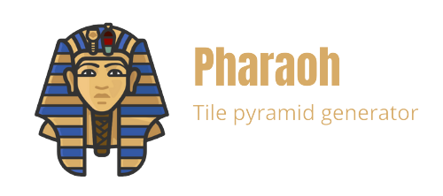

# Pharaoh

<p align="center">
    
</p>

Pharaoh is a tool that allows to easily deploy an environment able to work with raster data in any format. It is strongly focused on the generation of raster MBTiles pyramids with few command lines and several output options, such as transforming the greyscale data into RGB or generating the MBTiles in PNG format instead of JPEG.

## Usage

### Set up 

First of all, there are some environment variables that need to be established in the ```.env``` file, which are the following:

```
MIN_ZOOM           # min zoom to generate
MAX_ZOOM           # max zoom to generate
INPUT_FILE         # name of the input raster file
OUTPUT_FILE        # name of the output mbtiles file
```

Also, you can ask for a help message if you need
```shell
make help
```

### Build
To work on Pharaoh you need Docker.

- Install [Docker](https://docs.docker.com/engine/installation/). Minimum version is 1.12.3+.

To begin with, you need to initialize some necessary directories
```shell
make
```

Then, you can build the container pulling the image from the [Docker Hub](https://hub.docker.com/r/franmartin/pharaoh)
```shell
make build-docker
```

Or build it from the dockerfile
```shell
docker build -t pharaoh .
```

The docker image is based on ```osgeo/gdal```. For the raster data management, [rasterio](https://rasterio.readthedocs.io/en/latest/) and a few plugins from the [RasterIO Plugin Registry](https://github.com/mapbox/rasterio/wiki/Rio-plugin-registry), such as rio-mbtiles and rio-rgbify, are installed.

### Generate pyramid
And simply generate the tile pyramid. By default, it is generated in the data directory. 
```shell
make generate-pyramid
```

You can also generate the tile pyramid transforming the greyscale data into RGB data
```shell
make generate-pyramid-rgb
```

Or generate it in PNG format, removing the ```nodata``` values.
```shell
make generate-pyramid-png
```

### Custom
You can run a bash shell inside the docker container if you want to run some more detailed commands
```shell
make run-docker-shell
```

### Workflow to generate tile pyramids
If you go from top to bottom you can be sure that it will generate a .mbtiles file out of a raster file
```
make                        # generate necessary directories
make build-docker           # build the docker image
make generate-pyramid       # generate pyramid
```

## Authors
[Institut Cartogràfic i Geològic de Catalunya](https://www.icgc.cat/)

## License
This project is licensed under the MIT License - see the [LICENSE](LICENSE.md) file for details.